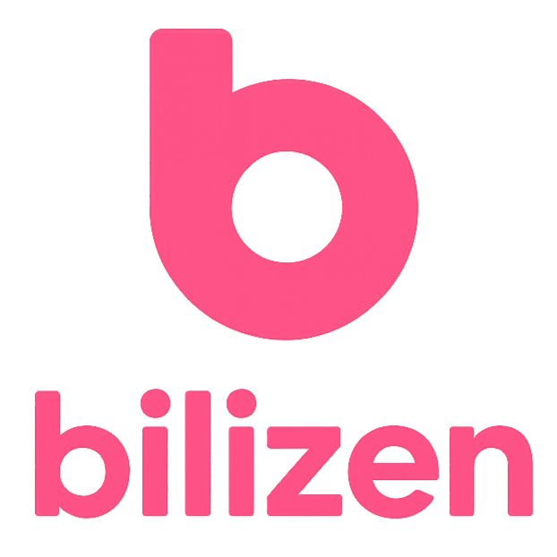

# Bilizen

  
  
  **一个专注于音频播放的跨平台 Bilibili 客户端**
  
  
  
  
  

## 📝 项目简介

Bilizen 是一个基于 Flutter 开发的跨平台 Bilibili 客户端，专注于提供类似网易云音乐的音频播放体验。让你可以更纯粹地享受 Bilibili 上的音频内容，无论是音乐、有声书还是播客。

但我们仍然为视频播放相关功能提供支持！

## 📥 下载

### 最新版本

**Windows 用户**
- [下载 Windows 版本](https://github.com/linyuansup/bilizen/releases/latest)

### 其他下载方式

- 查看所有版本：[GitHub Releases](https://github.com/linyuansup/bilizen/releases)
- 开发版本：可以从 `dev` 分支编译最新的开发版本

> **注意**: 目前仅提供 Windows 版本的预编译包，其他平台支持正在开发中。

## 📄 许可证

本项目采用 MIT 许可证 - 查看 [LICENSE](LICENSE) 文件了解更多信息。
